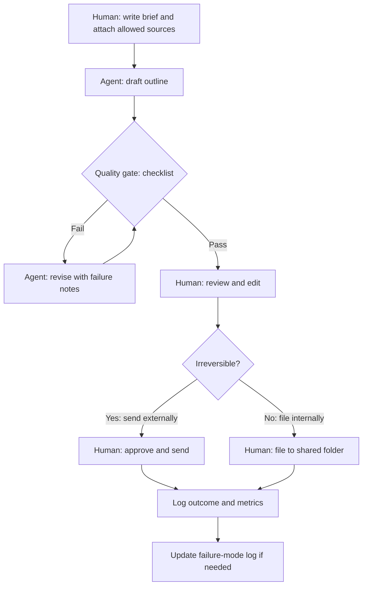

# Example HITL workflow (research summary)

Fictional internal workflow: turn a short brief plus allowed source notes into a first-pass summary for human review.

## State labels (for a simple runbook)
| State | Owner | Exit condition |
|---|---|---|
| `briefed` | Human | Brief and sources attached |
| `drafted` | Agent | Draft written |
| `gated` | Agent + checklist | Checklist pass or revise loop |
| `reviewed` | Human | Edits complete |
| `released` | Human | Filed or sent |
| `logged` | Either | Metrics and failures recorded |

A tiny state-machine sketch is in `examples/workflow_state.py`.
